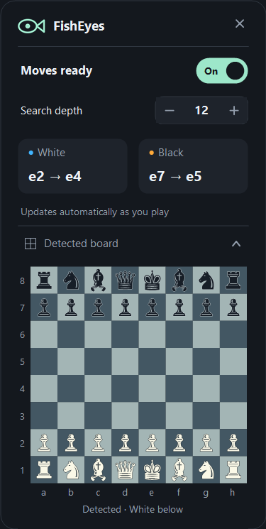
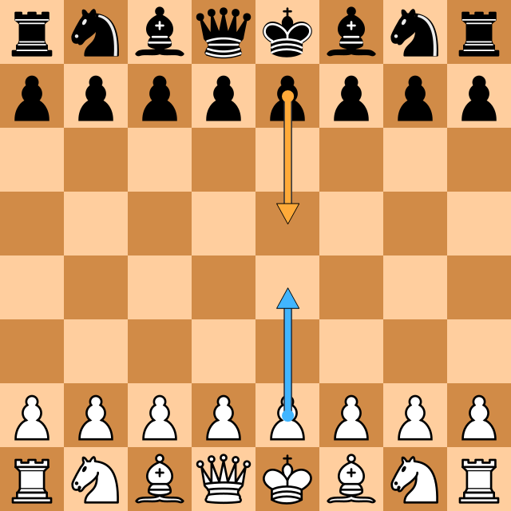
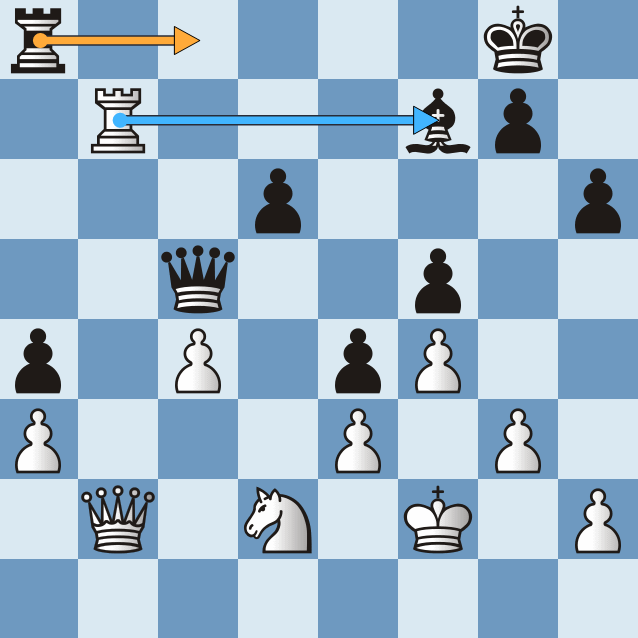
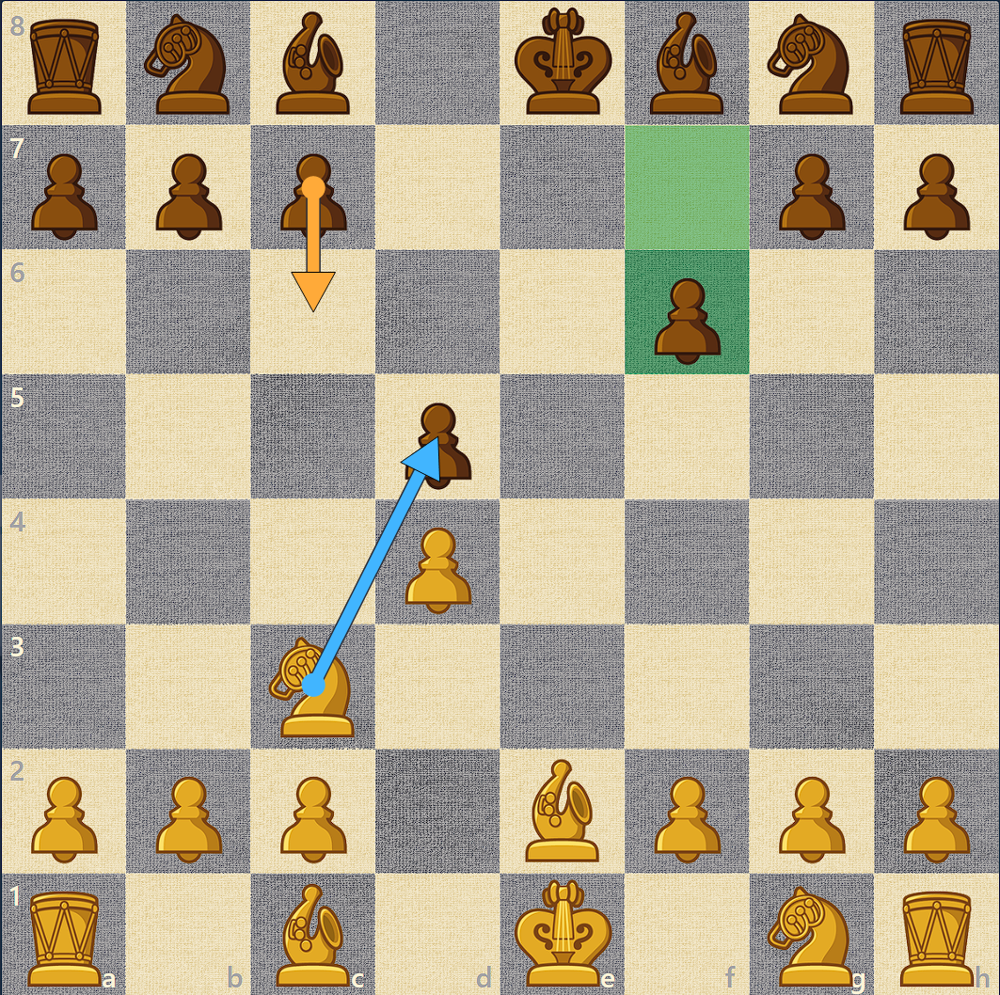

# FishEye

<br><br>

Have you ever looked at a chessboard and wondered what the best next move is?

FishEye watches your screen, detects the pieces, and asks Stockfish to figure it out. It draws the moves on your screen and in a little board preview. Just keep the board visible and turn it on.<br><br>

<br><br>

## Key Feature

- Automatically finds the board and pieces, without cropping.
- Recognizes 69 Chess.com 2D piece skins, including Band Class. No skin selection needed.
- Checks your screen about once every second.
- Blue arrow for White, orange arrow for Black—on your screen and in the preview.
- Adjustable search depth from 1 to 15.
- Board preview with Chess.com's Neo pieces and a quick 150 ms dropdown animation.
- Stays above other windows without taking keyboard focus, even while paused.
- Remembers analyzed positions, so it doesn't keep asking the API the same thing at the same depth.

Both arrows use the current board, each assuming that side is to move.<br><br>

## Board Preview

Wanna check if the pieces were read correctly? Click **Detected board** at the bottom of the overlay. It opens with a quick animation and shows the pieces FishEye sees, using Chess.com's Neo skin.

The preview follows the board's orientation and shows the same move arrows as your screen. It updates as you play, and old arrows disappear when the position changes. Click **Detected board** again to tuck it away.

Uncertain detections are labeled so you can inspect them, but aren't sent for analysis. Switching **Off** clears the preview too.<br><br>

## Move Suggestion

Here's what it looks like from the starting position.<br><br>

<br><br>

And on a different board. At depth 12, White gets **b7 → f7** and Black gets **a8 → c8**.<br><br>

<br><br>

## Chess.com Piece Skins

Using a different skin? FishEye automatically recognizes 69 Chess.com 2D piece sets, including the available bot and event skins. The templates are bundled, so there's nothing extra to download or select.

Recognition is also improved for the Bases skin at different board sizes, including highlighted squares and move-review badges.

Here's Band Class. At depth 12, White gets **c3 → d5** and Black gets **c7 → c6**.<br><br>

<br><br>

## How to Use

1. Open `FishEyes.exe`.
2. Keep the full chessboard visible on your screen.
3. Choose the search depth and switch **On**.
4. Wait for the arrows. Higher depth may take longer.
5. Open **Detected board** whenever you wanna check the detection.

Switch **Off** to pause, drag the FishEye header to move it, or press **×** to close.<br><br>

## Build from Source

You'll need Windows x64, the .NET 10 SDK, and PowerShell.

```powershell
.\scripts\build.ps1 -Test
```

Then open `artifacts/publish/win-x64/FishEyes.exe`.

If you just wanna run the source:

```powershell
dotnet run --project src/FishEyes
```

## Note

Keep the board clear and fully visible. 3D, blindfold, and checkers skins aren't supported. New skins and unusual endgames may still be misread. See [skin coverage](assets/themes/README.md). Castling and en passant aren't included in the suggestions.

Your screenshots stay on your PC. Only the board position and depth go to [StockfishOnline](https://stockfish.online/docs.php), so new analysis needs internet.

For more detail, check out the [development notes](docs/DEVELOPMENT.md). Piece recognition uses [chessvision](https://huggingface.co/harshitpawar64/chessvision); credits are in [third-party notices](licenses/README.txt).
